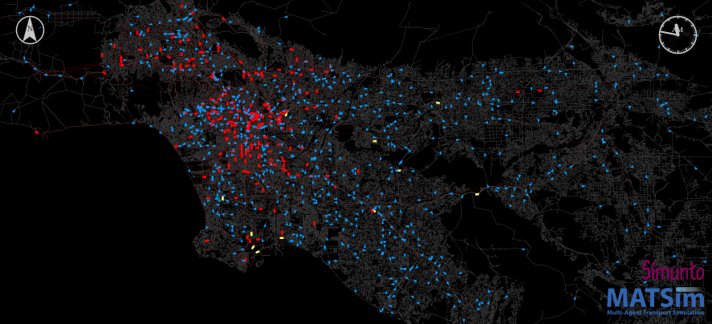

# The MATSim Open Los Angeles Scenario


### About this project

This repository provides an open MATSim transport model for Los Angeles, developed by the [Institute of Transportation Studies](https://its.ucdavis.edu) at [University of California, Davis](https://www.ucdavis.edu) and by the [Transport Systems Planning and Transport Telematics group](https://www.vsp.tu-berlin.de) of [Technische Universität Berlin](http://www.tu-berlin.de).


### Note

Handling of large files within git is not without problems (git lfs files are not included in the zip download; we have to pay; ...).  In consequence, large files, both on the input and on the output side, reside [here](https://svn.vsp.tu-berlin.de/repos/public-svn/matsim/scenarios/countries/us/los-angeles) .  

----
### Simple things (without installing/running MATSim)

##### Movies (TODO / Work in Progress)

1. Go [here](https://svn.vsp.tu-berlin.de/repos/public-svn/matsim/scenarios/countries/us/los-angeles)
1. Decide for a scenario that you find interesting and go into that directory.
1. Inside there, look for an `output-*` directory that you find interesting and go into that directory.
1. Inside there, look for `movie-*` files.  You can't view them directly, but you there are various ways to download them, and you can view them then.  Try that.

##### Run VIA on output files (TODO / Work in Progress)

1. Get VIA from https://www.simunto.com/via/.  (There is a free license for a small number of agents; that will probably work but only display a small number of vehicles/agents.)
1. Go [here](https://svn.vsp.tu-berlin.de/repos/public-svn/matsim/scenarios/countries/us/los-angeles) .
1. Decide for a scenario that you find interesting and go into that directory.
1. Inside there, look for an `output-*` directory that you find interesting and go into that directory.
1. Download `*.output_network.xml.gz` and `*.output_events.xml.gz`.  Best make sure that they do not uncompress, e.g. by "Download linked file as ...".
1. Get these files into VIA.  This can be achieved in various ways; one is to open VIA and then drag the files from a file browser into VIA.
1. Run VIA and enjoy.

----
### Downloading the repository - Alternative 1: Download ZIP

1. Click on `Clone or download` and then on `Download ZIP`.
1. Unzip the repository.
1. Go to "Run the MATSim Los Angeles scenario" below.

### Downloading the repository - Alternative 2: Clone the repository

##### Initial stuff (needs to be done once)

1. Install git for the command line.
1. Type `git clone https://github.com/matsim-scenarios/matsim-los-angeles.git` in the command line.

(Or use your IDE, e.g. Eclipse, IntelliJ, to clone the repository.)

This will result in a new `matsim-los-angeles` directory.  Memorize where you have put it.  You can move it, as a whole, to some other place.

##### Update your local clone of the repository.

1. Go into the `matsim-los-angeles` directory.
1. Type `git pull`

(Or use your IDE, e.g. Eclipse, IntelliJ, to update the repository.)

This will update your repository to the newest version.

----
### Run the MATSim Los Angeles scenario

##### ... using a runnable jar file (TODO / Work in Progress)
(Requires either cloning or downloading the repository.)

1. There should be a *.jar file directly in the `matsim-los-angeles` directory.
1. Double-click on that file (in a file system browser).  A simple GUI should open.
1. In the GUI, click on the "Choose" button for configuration file.  Navigate to one of the `scenario` directories and load one of the configuration files.
1. Increase memory in the GUI.
1. Press the "Start MATSim" button.  This should run MATSim.  Note that MATSim accepts URLs as filenames in its config, so while the config files are part of the git repo, running them will pull additional material from our server.
1. "Open" the output directory.  You can drag files into VIA as was already done above.
1. "Edit..." (in the GUI) the config file.  Re-run MATSim.

##### ... using an IDE, e.g. Eclipse, IntelliJ - Alternative 1: use cloned/downloaded matsim-los-angeles repository
(Requires either cloning or downloading the repository.)

1. Set up the project in your IDE.
1. Make sure the project is configured as maven project.
1. Run the JAVA class `src/main/java/org/matsim/run/RunLosAngelesScenario.java` or `src/main/java/org/matsim/gui/RunLosAngelesScenarioGUI.java`.
1. "Open" the output directory.  You can drag files into VIA as was already done above.
1. Edit the config file or adjust the run class. Re-run MATSim.

##### ... using an IDE, e.g. Eclipse, IntelliJ - Alternative 2: use matsim-los-angeles as a maven dependency

1. Clone the matsim-example-project: https://github.com/matsim-org/matsim-example-project
2. Add a maven dependency to the Open Los Angeles project by writing the following to the pom file:

```xml
<repository>
  <id>jitpack.io</id>
  <url>https://jitpack.io</url>
</repository>
```

```xml
<dependency>
  <groupId>com.github.matsim-scenarios</groupId>
  <artifactId>los-angeles</artifactId>
  <version>master-SNAPSHOT</version>
</dependency>
```

Or use a release number or commit hashId instead of 'master-SNAPSHOT'. See here: https://jitpack.io/#matsim-scenarios/matsim-los-angeles

3. Write your own run class and make sure to execute the required public methods in RunLosAngelesScenario:

```
Config config = RunLosAngelesScenario.prepareConfig( args ) ;
// possibly modify config here

Scenario scenario = RunLosAngelesScenario.prepareScenario( config ) ;
// possibly modify scenario here

Controler controler = RunLosAngelesScenario.prepareControler( scenario ) ;
// possibly modify controler here, e.g. add your own module

controler.run

```

### More information

For more information about MATSim, see here: https://www.matsim.org/. For more information about the demand generation, see here: http://www.scag.ca.gov/.

### Acknowledgements

We are grateful to the Southern California Association of Governments (http://www.scag.ca.gov/) for supporting this model developing effort with data and staff time. We are also greatful to the California Department of Transportation for funding this research through their sustainable planning grant programs.
